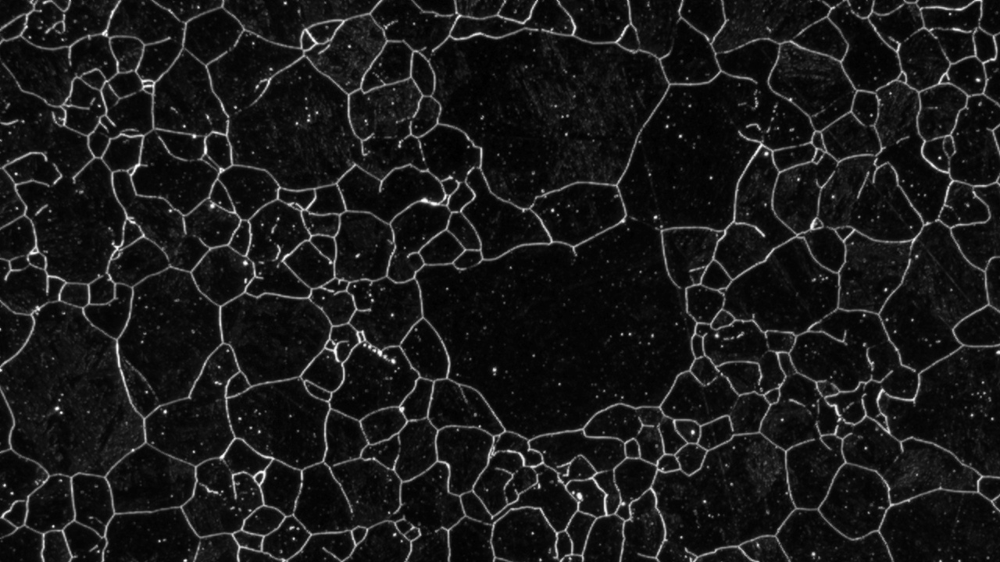
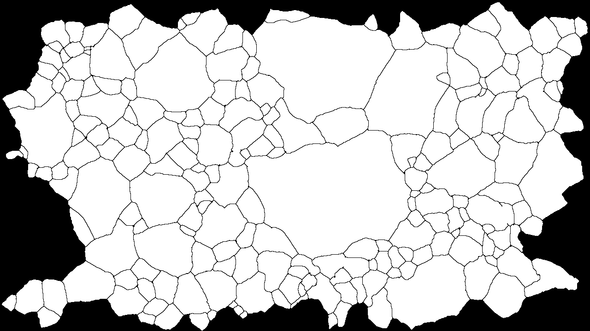

# Metalle, Daten, Klänge

Wie können mikrostopische Strukturen hörbar gemacht werden? Wenn ein Geigerzähler, ein Tremolo oder eine E-Gitarre analog sonifizieren, welche algorithmischen Möglichkeiten gibt es für digitalen Daten? Um aus mikroskopischen Strukturen, Geräusche oder sogar Musik zu generieren sind Datenerhebung, -verarbeitung und Klangsynthese drei fundamentale Schritte.
Als Datenbasis meines Projektes soll eine Sammlung mikroskopischer Aufnahmen einer Partikelstruktur dienen. Die Verarbeitung findet in Processing statt und für die Klangsynthese ist die Java-Library Minim zuständig.

### Grundüberlegungen

Das naheliegenste bei pixelbasierenden Bilddaten ist sicherlich, die RGB-Werte direkt als Grundlage zur Steuerung von Oszillatoren zu verwenden. So können sie in einer bestimmten Reihenfolge einfach "abgespielt" werden. Ein simples Beispiel dafür könnte sein, den Rot-Wert eines Pixels auf die Tonhöhe, also die Oszillatorfrequenz und den Blau-Wert desselben auf die Lautstärke, also die Amplitude abbilden. Dabei würden pinke bis weiße Pixel in hohen, lauten Tönen resultieren, rote dagegen in hohen, leisen und blaue in tiefen, lauten Tönen. Je dunkler desto leiser der Ton.
Was Bilddaten betrifft, ist es für eine gelungene Klangsynthese allerdings von großer Bedeutung, dass die Tonkulisse in einem intuitiv nachvollziehbaren Zusammenhang zum Ausgangsmaterial steht. Damit ist nicht gemeint, dass der Hörer die genauen Mechanismen der Klangsynthese durchschaut, sondern viel mehr, dass das Gehörte und Gesehene auf eine Weise zusammenpassen, die für den Hörer plausibel erscheint. Ein zentrale Aufgabe bestand also darin, Tonkulissen auf Nachvollziehbarkeit zu prüfen und iterativ zu entwickeln.

### Datenverarbeitung

Die auf dem Bild zu erkennenden Sektionen bieten sich als "klingende Instanzen" gut an. Damit mit ihnen gearbeitet werden kann, müssen die Sektionen als Daten bekannt sein. Da die algorithmische Erkennung der Sektionen aufgrund von Bildrauschen und teilweise uneindeutiger Sektionsgrenzen fehleranfällig ist, kam außerdem eine Karte zum Einsatz, in der die Sektionsgrenzen von Hand - und dadurch definitiv - eingezeichnet wurden. Alle Sektionen, die über den Rand des Bildes hinausgehen wurden weggelassen.

Diese Daten sind sehr "algorithmenfreundlich", da nur weiße und schwarze Pixel enthalten sind und die Sektionen so eindeutig und automatisiert erkannt werden können. Die erste große Herausforderung bestand deshalb darin, die Pixel innerhalb einer Sektion zu zählen. Nach verschiedenen Anläufen bewährte sich ein rekursiver Algorithmus, der, ausgehend von gegebenen Koordinaten, nach oben und unten alle weißen Pixel derselben Spalte zählt, bis er auf ein schwarzes stößt und dies solange für die Nachbarspalten wiederholt, bis in einer Nachbarspalte keine weißen Pixel mehr auftauchen. Intern wird dabei zwar auf die Grenzkarte zugegriffen, da diese für den Benutzer aber keinen Mehrwert bietet, wird in der Anwendung dennoch das Ursprungsfoto angezeigt. Bei Programmstart wird die Karte von links nach rechts komplett analysiert und für jede gefundene Sektion ein entsprechendes Objekt erstellt das die Grundlage für die Tonsynthese sein wird. Da während der Analyse jedes Pixel betrachtet wird, kann eine "Durchschnittsposition" errechnet werden, an welcher später die Summe angezeigt. Außerdem kann die Breite und Höhe jeder Sektion (Differenz zwischen höchster und niedrigster x-, bzw. y-Koordinate) bestimmt werden, die für die Tonsynthese interessant sind.

### Tonsynthese

Als Grundlage der Tonsynthese kommt die Java Library "Minim" ([http://code.compartmental.net/minim/index.html](http://code.compartmental.net/minim/index.html)) zum Einsatz. Im Vergleich zu Processings internen Tonsynthesewerkzeugen arbeitet es asynchron. Es steht eine Art Timeline zur Verfügung, auf die eine ganze Reihe von Noten im Vorraus programmiert werden kann, die dann zeitlich exakt unabhängig vom Hauptprozess abgespielt werden.
Für die Erzeugung einer Note kommen ein Oszillator mit Sägezahn-Wellencharakteristik und ein ADSR zum Einsatz. Eine höhere Pixelsumme bewirkt eine tiefere Frequenz und eine höhere Amplitude. Die Breite einer Sektion wirkt sich außerdem auf den *RELEASE* des ADSR aus, was sie länger nachhallen lässt.
Da die Größe der Sektionen sehr unterschiedlich ist und sich teilweise um das hundertfache unterscheidet, wird die Pixelsumme nicht linear auf die Tonsyntheseparameter abgebildet, sondern logarithmisch. 

Mit der Einführung der Sektionen als klingende Elemente, bin ich stillschweigend davon ausgegangen, dass immer nur ausgewählte Bereiche des Bildes in einer Reihenfolge "erklingen". Das muss natürlich nicht so sein und das Bild könnte auch zu einem einzigen Geräusch werden, indem sich verschiedene Strukturen unterschiedlich hörbar machen. Ich habe mich für eine Kombination aus beidem entschieden, indem der Benutzer verschiedene Möglichkeiten zur Tonerzeugung in Form mehrerer Abspielmodi erhält:
*  Abspielen des gesamten Bildes von links nach rechts (`ENTER`)
*  Abspielen des Sektionen entlang einer selbst gezogenen Achse (Mausklick und ziehen)
*  Kombination mehrerer Sektionen zu einem Akkord. Hierfür werden mehrere Sektionen der Reihe nach angeklickt und mit Tastendruck einem Buchstaben zugeordnet. Anschließend löst derselbe Tastendruck den Mehrklang aus.

Es stehen insgesamt 4 Bilder zur Verfügung, damit die Unterschiedlichkeit der einzelnen Tonkulissen gut hörbar wird. Diese können mit den Pfeiltasten im laufenden Betrieb durchgetauscht werden

#### Konfigurationsmöglichkeiten

Zu Beginn des Processing-Pojektes (`alloy_grain_synthesis.pde`) stehen einige Konfigurationsgrößen bereit. Diese können beliebig verändert werden und sollten durch die Kommentierung selbsterklärend sein.